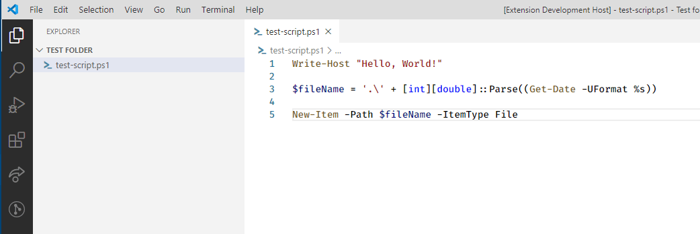
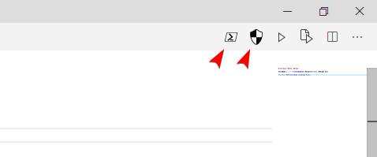
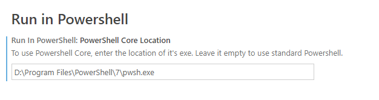

# Run-in-Powershell README

This extension allows you to run `.ps1` files in a powershell terminal **external** to VS Code.

## Features

- Run files in terminals external to VS Code
- Optionally use Powershell Core
- Optionally run the terminal with admin privileges

### File Context Menu

You can run your `.ps1` scripts in terminals external to VS Code by using the file context menu.

### Editor Title

You can also run the commands from the editor title

### Powershell Core

To use Powershell Core, configure the location of your `.exe` in the settings, else leave it empty.

Icons by <a target="_blank" href="https://icons8.com">Icons8</a>.

## License

Run-in-Powershell is licensed under the [ISC License](https://github.com/tobysmith568/run-in-powershell/blob/main/LICENSE).
